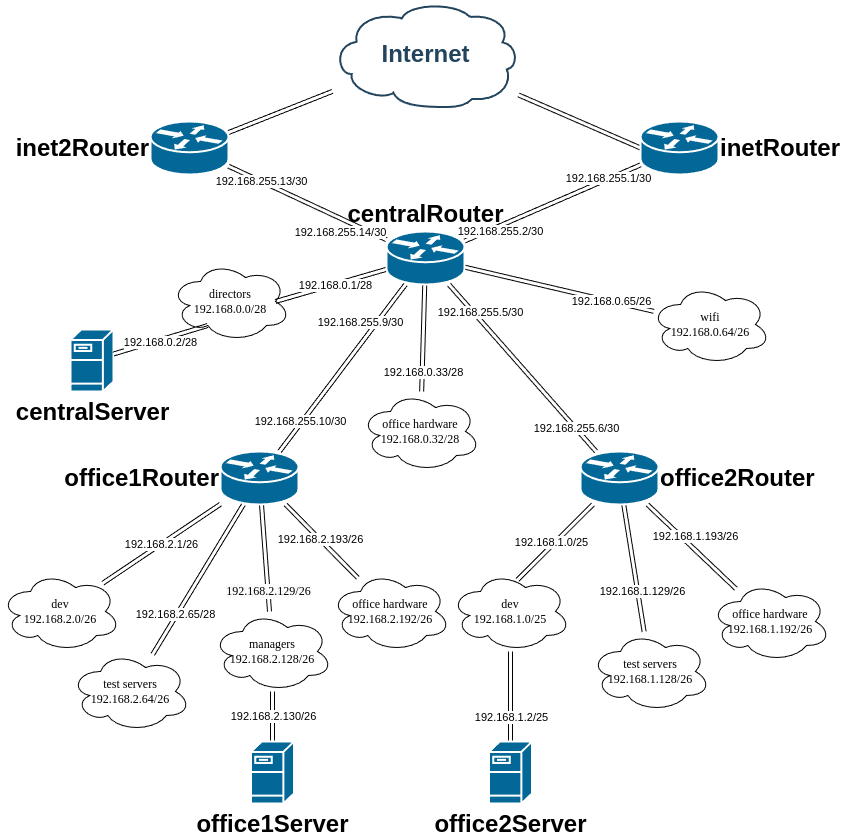

# Сценарии iptables

## Задание

1. Реализовать **knocking port**. **centralRouter** может попасть на **ssh** **inetRouter** через **knock** скрипт.
2. Добавить **inet2Router**, который виден(маршрутизируется (**host-only** тип сети для виртуалки)) с хоста.
3. Запустить nginx на **centralServer**.
4. Пробросить 80й порт на **inet2Router** 8080.
5. Дефолт в инет оставить через **inetRouter**.

Реализовать проход на 80й порт без маскарадинга.

## Cхема сети



## Реализация

Задание сделано на **rockylinux/9** версии **v4.0.0**. Для автоматизации процесса написан **Ansible Playbook** [playbook.yml](playbook.yml) который:

- включает **ip forwarding** на маршрутизаторах;
- настраивает **masquerade** на **inetRouter;
- настраивает сеть на всех узлах (через **nmcli**).

Используется конфигурация сети, определённая в [host_vars](host_vars):

- [inetRouter](host_vars/inetRouter.yml);
- [inet2Router](host_vars/inetRouter.yml);
- [centralRouter](host_vars/centralRouter.yml);
- [office2Router](host_vars/office2Router.yml);
- [office1Router](host_vars/office1Router.yml);
- [centralServer](host_vars/centralServer.yml);
- [office2Server](host_vars/office2Server.yml);
- [office1Server](host_vars/office1Server.yml).

Для настройки серверов написаны следующие роли **Ansible**:

- **nginx** - устанавливает **nginx** на **centralServer** c конфигурацией по умолчанию и включает и запускает сервис.
- **ip_forward** - включает **ip forwarding** на маршрутизаторах.
- **rt_tables** - создаёт дополнительные таблицы маршрутизации в файле `/etc/iproute2/rt_tables` на **centralRouter**.
- **nftables** - настраивает **nftables** на **inetRouter** и **inet2Router**.
- **network_config** - настраивает сеть на всех узлах (через **nmcli**).
- **vagrant_ssh_config** - копирует необходимые ключи для подключения к узлам и настраивает **ssh** для пользователя **vargrant** на всех узлах.
- **portknock_script** - коирует скрипт `portknock.sh` для отправки **knock** последовательности на указанный узел для последующего подключения по **ssh**.

**Port knocking** реализован в правилах **nftables** на **inetRouter**, смотри [inetRouter.conf](roles/nftables/templates/inetRouter.conf). Доступ осуществляется путём последовательной отправки пакетов на **UDP** порты 22222 2222 222 22 в течении одной секунды и открывается для отправившего пакеты узла на 1 минуту. Для отправки пакетов написан скрипт [portknock.sh](roles/portknock_script/templates/portknock.sh).

Порт 80 сервера **centralServer** проброшен на 8080 порт **inet2Router** через правила **nftables**, смотри [inet2Router.conf](roles/nftables/templates/inet2Router.conf). Обратный машрут указан на **centralRouter** через **Policy Based Routing**. Для этого на **centralRouter** создана таблица **inet2** с идентификатором 200 с маршрутом по умолчанию через **inet2Router**, в которую отправляются пакеты с 80 порта сервера **centralServer**. Смотри файл [host_vars/centralRouter.yml](host_vars/centralRouter.yml):

```yaml
rt_tables_map:
  '200': inet2
nmcli_connections:
  - conn_name: central-inet2
    routes4_extended:
      - ip: '0.0.0.0/0'
        next_hop: '192.168.255.13'
        table: 200
    routing_rules4:
      - priority 200 from 192.168.0.2 sport 80 table 200
```

Выглядит это следующим образом:

```text
[vagrant@centralRouter ~]$ ip route
default via 192.168.255.1 dev eth1 proto static metric 101
default via 192.168.255.13 dev eth2 proto static metric 102
10.0.2.0/24 dev eth0 proto kernel scope link src 10.0.2.15 metric 100
192.168.0.0/28 dev eth5 proto kernel scope link src 192.168.0.1 metric 105
192.168.0.32/28 dev eth6 proto kernel scope link src 192.168.0.33 metric 107
192.168.0.64/26 dev eth7 proto kernel scope link src 192.168.0.65 metric 106
192.168.1.0/24 via 192.168.255.6 dev eth3 proto static metric 103
192.168.2.0/24 via 192.168.255.10 dev eth4 proto static metric 104
192.168.255.0/30 dev eth1 proto kernel scope link src 192.168.255.2 metric 101
192.168.255.4/30 dev eth3 proto kernel scope link src 192.168.255.5 metric 103
192.168.255.8/30 dev eth4 proto kernel scope link src 192.168.255.9 metric 104
192.168.255.12/30 dev eth2 proto kernel scope link src 192.168.255.14 metric 102
[vagrant@centralRouter ~]$ ip route show table 200
default via 192.168.255.13 dev eth2 proto static metric 102
[vagrant@centralRouter ~]$ ip rule
0:      from all lookup local
200:    from 192.168.0.2 sport 80 lookup inet2 proto static
32766:  from all lookup main
32767:  from all lookup default
```

## Запуск

Необходимо скачать **VagrantBox** для **rockylinux/9** версии **v4.0.0** и добавить его в **Vagrant** под именем **rockylinux/9/v4.0.0**. Сделать это можно командами:

```shell
curl -OL https://app.vagrantup.com/rockylinux/boxes/9/versions/4.0.0/providers/virtualbox/amd64/vagrant.box
vagrant box add vagrant.box --name "rockylinux/9/v4.0.0"
rm vagrant.box
```

Для того, чтобы **vagrant 2.3.7** работал с **VirtualBox 7.1.0** необходимо добавить эту версию в **driver_map** в файле **/usr/share/vagrant/gems/gems/vagrant-2.3.7/plugins/providers/virtualbox/driver/meta.rb**:

```ruby
          driver_map   = {
            "4.0" => Version_4_0,
            "4.1" => Version_4_1,
            "4.2" => Version_4_2,
            "4.3" => Version_4_3,
            "5.0" => Version_5_0,
            "5.1" => Version_5_1,
            "5.2" => Version_5_2,
            "6.0" => Version_6_0,
            "6.1" => Version_6_1,
            "7.0" => Version_7_0,
            "7.1" => Version_7_0,
          }
```

После этого нужно сделать **vagrant up**.

Протестировано в **OpenSUSE Tumbleweed**:

- **Vagrant 2.3.7**
- **VirtualBox 7.1.4_SUSE r165100**
- **Ansible 2.17.5**
- **Python 3.11.10**
- **Jinja2 3.1.4**

## Проверка

Подключимся к **centralRouter** и проверим подключение к **inetRouter**. Подключение невозможно, так как порт закрыт:

```text
❯ vagrant ssh centralRouter
Last login: Mon Oct 21 10:27:28 2024 from 10.0.2.2
[vagrant@centralRouter ~]$ ssh inetRouter
ssh: connect to host inetrouter port 22: Connection timed out
```

Запустим `portknock.sh` и попробуем подключиться повторно. Подключение успешно осуществлено:

```text
[vagrant@centralRouter ~]$ portknock.sh inetRouter
[vagrant@centralRouter ~]$ ssh inetRouter
The authenticity of host 'inetrouter (192.168.255.1)' can't be established.
ED25519 key fingerprint is SHA256:J1ALl3WldGd879ufwPSKmTWBoxugGICK5BA9Xpdg1HI.
This key is not known by any other names
Are you sure you want to continue connecting (yes/no/[fingerprint])? yes
Warning: Permanently added 'inetrouter' (ED25519) to the list of known hosts.
Last login: Mon Oct 21 10:17:40 2024 from 10.0.2.2
[vagrant@inetRouter ~]$
```

В логах на **inetRouter** можно найти запись об успешном срабатывании правил **portknock**:

```text
❯ vagrant ssh inetRouter -c 'dmesg -T | grep portknock'
[Mon Oct 21 10:38:24 2024] Successful portknock: IN=eth1 OUT= MAC=08:00:27:0d:0d:05:08:00:27:09:ef:ac:08:00 SRC=192.168.255.2 DST=192.168.255.1 LEN=33 TOS=0x00 PREC=0x00 TTL=64 ID=50352 DF PROTO=UDP SPT=44900 DPT=22 LEN=13
```

Проверим проброс порта 80 сервера **centralServer** проброшен на 8080 порт **inet2Router** через **curl**:

```text
❯ curl -v -o /dev/null http://192.168.56.14:8080
  % Total    % Received % Xferd  Average Speed   Time    Time     Time  Current
                                 Dload  Upload   Total   Spent    Left  Speed
  0     0    0     0    0     0      0      0 --:--:-- --:--:-- --:--:--     0*   Trying 192.168.56.14:8080...
* Connected to 192.168.56.14 (192.168.56.14) port 8080
* using HTTP/1.x
> GET / HTTP/1.1
> Host: 192.168.56.14:8080
> User-Agent: curl/8.10.1
> Accept: */*
>
* Request completely sent off
< HTTP/1.1 200 OK
< Server: nginx/1.20.1
< Date: Mon, 21 Oct 2024 10:50:37 GMT
< Content-Type: text/html
< Content-Length: 7620
< Last-Modified: Wed, 21 Feb 2024 13:12:33 GMT
< Connection: keep-alive
< ETag: "65d5f6c1-1dc4"
< Accept-Ranges: bytes
<
{ [7620 bytes data]
100  7620  100  7620    0     0  5650k      0 --:--:-- --:--:-- --:--:-- 7441k
* Connection #0 to host 192.168.56.14 left intact

```

Также можно открыть адрес [192.168.56.14:8080](http://192.168.56.14:8080) в браузере.
